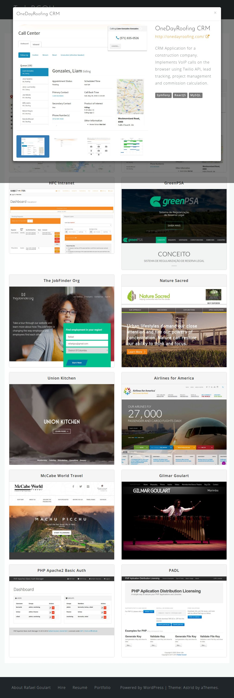
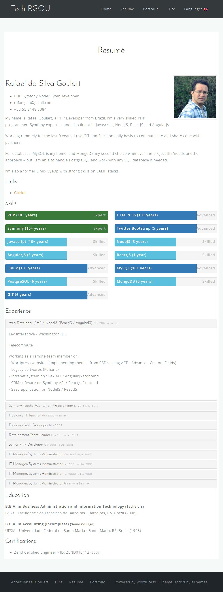
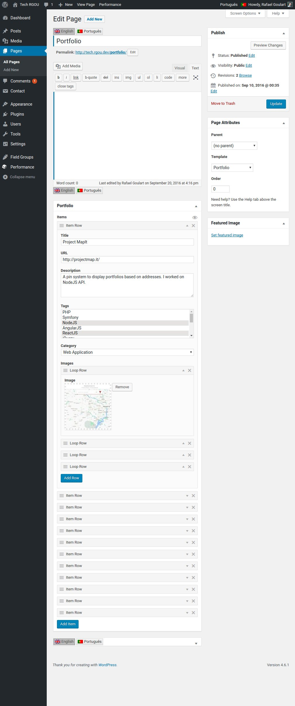
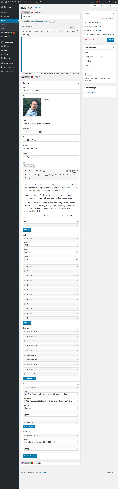

# Wordpress Portfolio/Resumè using Custom Fields Suite

A simple [Wordpress](wordpress.org) Portfolio/Resumè page content using
[Custom Fields Suite](https://wordpress.org/plugins/custom-field-suite/)
to create a cool form to fill data.

*   [Wordpress](wordpress.org)
*   [Custom Fields Suite](https://wordpress.org/plugins/custom-field-suite/)
*   [Twitter Bootstrap](http://getbootstrap.com) (optional)

Take a shot:

*   [Rafael Goulart Portfolio](http://tech.rgou.net/portfolio)
*   [Rafael Goulart Resumè](http://tech.rgou.net/resume)

## About it

This is sample implementation, but you can (**need**) to customize to your own
needs/theme. `templates/portfolio.php` and `templates/resume.php` are based on
[Twitter Bootstrap](http://getbootstrap.com), so your theme must be also based
on it. But you can just get the idea and implement your own visual (really
recomended!)

My implementation uses [Athemes Astrid theme](http://athemes.com/theme/astrid/)
with full [Twitter Bootstrap](http://getbootstrap.com) version (the theme
uses a custom version, but I want a custom carousel, modal and accordian,
so I use the full verstion). Some custom CSS and JS are on `css/`
and `js/` directories.

## Using

1.  Install [Custom Fields Suite](https://wordpress.org/plugins/custom-field-suite/)

2.  Import custom fields on Menu -> Field Groups -> Tools -> Import

3.  Add templates (`templates/portfolio.php` and `templates/resume.php`) to
    your theme directory and customize them.

4.  Create a Portfolio page and select `Portfolio` template. Now you can add
    content using custom fields      

5.  Create a Resumè page and select `Resume` template. Now you can add
    content using custom fields      

You can add your own fields or remove what you don't need, of course!

## Screenshots

**Note**: Sadly [qTranslate-X](https://wordpress.org/plugins/qtranslate-x/) doesn't work with [Custom Fields Suite](https://wordpress.org/plugins/custom-field-suite/), so you can see it on screenshots just because my blog is bilingual.
